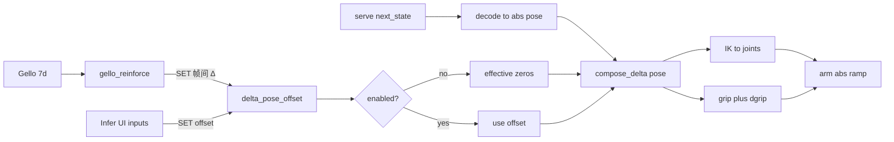

# Gello 强制干预（瞬时 delta pose offset）— 开发计划

日期：2026-09-18  
状态：**已实现首版**  
关联：[pi05-infer-tab.md](pi05-infer-tab.md) · [gello-arm-teleop.md](gello-arm-teleop.md) · [gello-arm-sync.md](gello-arm-sync.md) · [tcp-drag-ik.md](tcp-drag-ik.md)

> **范围声明：** 在 pi05 serve 解码路径上叠加一层**瞬时/短时** `delta_pose_offset`；可由 Infer UI 观察/微调，也可由新 agent `gello_reinforce` 按 **Gello 帧间 delta** 覆盖写入。  
> **不是**摇操/同步的替代；**不**改普通点动 / Home / `arm_command` 直发路径。  
> **不是**「启用后相对基准挂住」的持续微调——停手后 offset 应回到近似零。

---

## 0. 对话结论（约束）

| # | 结论 |
|---|------|
| 1 | 无论 serve 返回 `joints` / `pose` / `delta_pose`，解码后都先落到**绝对 TCP pose（xyzrpy）**，再与当前 `delta_pose_offset` 合成，最后 IK → `joints` 下发。夹爪维也走 offset（第 7 维）。 |
| 2 | `delta_pose_offset = [dx, dy, dz, drx, dry, drz, dgrip]`，默认全 `0.0`。 |
| 3 | 新 agent `gello_reinforce`：扫描 peer Gello 的 7 维；**用帧间相对位姿**算出 delta（前 6 维 SE(3) 相对变换 + 第 7 维标量差），**整段 SET** 到 offset。 |
| 4 | YAML **没有**该 agent → 不持久化 offset；Infer 前端 offset 控件**置灰不可用**。配置了 → 控件可用，并另加**启用/禁用**复选框。 |
| 5 | Offset 语义：**帧间瞬时**——有运动才非零；停手后 Δ≈0，有效干预消失。下发侧只读当前 offset 一次叠到 serve 目标，**不再二次累加**。 |
| 6 | 禁用复选框 → **整功能停用**：有效 offset 全零，行为等同「从未开过此功能」。 |
| 7 | 体感「短时」：干预只存在于有运动的采样拍；叠进当次 serve 目标后，还会跟着该步 abs-ramp 跑完。 |

---

## 1. 产品边界（必读）

### 1.1 做什么 / 不做什么

```text
做：
  - Orchestrator 持有 delta_pose_offset[7] + enabled
  - 仅在 pi05 decode（_decode_next_state）与 grip 提取路径上叠加
  - UI 可 SET offset；gello_reinforce 可 SET offset（帧间 Δ 覆盖写入）
  - 无 agent 时 UI 置灰；有 agent 时可用启用复选框

不做：
  - 不替代 gello→arm 同步 / 摇操
  - 不改 arm_command 普通点动、Home、TCP 拖拽直发
  - 无 gello_reinforce 时不写 YAML / 不持久化 offset
  - 不把 Gello 相对启用基准「挂住」成持续偏移
  - 不把帧间 Δ 长期 compose/积分进 sticky offset
```

### 1.2 与摇操 / 同步的分工

| 功能 | 控臂方式 | Gello 角色 |
|------|----------|------------|
| 同步 | 一次性关节插值对齐 | 冻结目标 |
| 摇操 | 50Hz 关节跟随 | live 关节直接当下发目标 |
| **强制干预** | 不直接写臂；改 serve 解码后的目标 pose | **帧间 Δ → 瞬时 offset** |

三者互不合并：强制干预只影响 **pi05 step → decode → abs-ramp** 这条链。

### 1.3 禁用语义

- `enabled == false`：下发路径使用**有效全零** offset（`compose` 跳过或恒等）。
- 不要求清空 UI 输入框；重新启用时 **重采 prev**（见 §2.2），offset 先置零。
- 行为上等价于「回退到没有此功能之前」。

---

## 2. 数据流与语义

### 2.1 总览

```text
serve next_state[7]
        │
        ▼
  decode → 绝对 TCP pose（+ 原始 grip）
        │
        ▼
  effective_offset = enabled ? offset[7] : zeros
        │
        ├─ pose' = compose_delta(pose, offset[:6])   # T' = T @ T_offset
        ├─ grip' = grip + offset[6]
        │
        ▼
  IK(pose') → joints → abs-ramp / 下发
  grip'     → abs-ramp 开始时一次下发（与关节斜坡解耦，避免 Modbus 拖慢点位）
```



### 2.2 Gello → offset（帧间瞬时，非基准挂住）

约定写死：

1. **启用**时：`prev[7] = 当前 gello.joints_rad`；`offset = zeros[7]`。
2. 之后每拍读 `cur[7]`：
   - `T_prev = FK(prev[:6])`，`T_cur = FK(cur[:6])`（与臂同一套 hik FK / TCP）
   - `T_delta = inv(T_prev) @ T_cur` → `delta_xyzrpy`（`relative_xyzrpy`）
   - `dgrip = cur[6] - prev[6]`
   - **整段 SET** `offset = [*delta_xyzrpy, dgrip]`（替换，**不是** `offset = compose(offset, Δ)`）
   - `prev ← cur`
3. 停手：相邻两拍几乎相同 → `offset ≈ 0` → 干预自然消失。
4. UI 输入框显示当前 `offset`；agent 写入后 status 轮询回填。下发时读 Orchestrator 内存态（勿每帧扫 DOM）。

**刻意不做：** 每拍相对启用 baseline 的 `inv(T_base)@T_cur`（那会「掰开按住一直偏」）；也不做帧间 Δ 的长期 SE(3) 积分。

### 2.3 各 recv 格式

| `next_state_format` | 先得到 abs pose 的方式 | 再叠加 offset |
|---------------------|------------------------|---------------|
| `pose` | `next_state[:6]` 即 TCP | `compose_delta` → IK |
| `delta_pose` | `compose_delta(live_TCP, next_state[:6])` | 再 `compose_delta(..., offset[:6])` → IK |
| `joints` | 见下 | 见下 |

**joints 接收格式（避免无意义往返误差）：**

- `enabled == false` 或 `offset[:6]` 全近似零：保持现有 **joints 直通**（不 FK→IK）。
- `enabled` 且 pose 偏移非零：`goal = FK(joints)` → `compose` → IK → 新 joints。
- 夹爪：只要 `enabled`，始终 `grip' = grip + offset[6]`（即便前 6 维为零）。

### 2.4 合成约定

- 位姿：`compose_delta_xyzrpy(abs, offset[:6])` ≡ `T_abs @ T_offset`（与现有 serve `delta_pose` 左乘一致）。
- 夹爪：标量相加（`position_norm` 空间）；不做夹取限幅以外的新规则（沿用 abs-ramp / clip 既有逻辑）。

---

## 3. 配置 / Agent

### 3.1 `AgentConfig`

文件：`src/sensors_dcs/config.py`

- `type` Literal 增加 `"gello_reinforce"`。
- 新增可选字段 `gello_agent_id: str | None`（指向已有 `type: gello` 的 agent id）。
- 与 `pi05` 一样：**不要求** `sensor_id`（validator 放行）。

### 3.2 `GelloReinforceAgent`

新文件：`src/sensors_dcs/agents/gello_reinforce_agent.py`

| 项 | 约定 |
|----|------|
| `kind` | `"gello_reinforce"` |
| Sensor | NullSensor（同 `Pi05ClientAgent`） |
| Peer | `bind_peers(agents)` → 解析 `gello_agent_id`（缺省可找唯一 `GelloAgent`） |
| 环 | `@hz` 读 gello ring → 算帧间 Δ → 调 Orchestrator setter（仅 `enabled` 时） |
| 与 Orchestrator | 启动时注入 setter / enabled 查询；**单一内存真源**在 Orchestrator |

`build_agent`（`agents/__init__.py`）与 `Orchestrator.__init__`：对 `gello_reinforce` 走无 sensor 分支，并 `bind_peers`。

### 3.3 YAML 示例片段

```yaml
agents:
  - id: gello
    type: gello
    sensor_id: gello-leader
    hz: 50
    buffer_frames: 64
  # ... arm / cameras / pi05 ...
  - id: gello-reinforce
    type: gello_reinforce
    hz: 20
    buffer_frames: 8
    gello_agent_id: gello
```

落地位置：含 gello + pi05 的配置（如扩展 `configs/full_cell_plus.yaml` 或新增独立示例）。

### 3.4 有无 agent 判定

```text
configured = any(a.kind == "gello_reinforce" for a in agents)
```

- `configured == false`：`enabled` 强制视为 false；GET status 标 `configured: false`；POST 改 offset/enabled → `ok: false`；UI 置灰。
- `configured == true`：允许 UI / API 改 `enabled` 与 `offset`。

---

## 4. Runtime

文件：`src/sensors_dcs/runtime.py`

### 4.1 状态

| 字段 | 含义 |
|------|------|
| `_delta_pose_offset_configured` | 是否存在 `gello_reinforce` agent |
| `_delta_pose_offset_enabled` | 用户/API 启用（默认 `false`） |
| `_delta_pose_offset` | `list[float]` 长度 7，默认全 0 |
| `_delta_pose_offset_prev_gello` | 上一拍 gello[7]；未采则为 `None` |
| `_delta_pose_offset_lock` | 线程锁 |

### 4.2 API 形方法

- `delta_pose_offset_status() -> dict`
- `set_delta_pose_offset(offset: list[float] | None) -> dict` — 校验 7 有限浮点；未配置则失败
- `set_delta_pose_offset_enabled(enabled: bool) -> dict` — `True` 时重采 `prev`、offset 置零；`False` 时有效零
- `effective_delta_pose_offset() -> list[float]` — 供 decode 使用：未配置或未启用 → 全零
- `note_gello_reinforce_sample(joints7) -> dict` — agent 调用：由 `prev` 算帧间 Δ 并 SET；更新 `prev`

挂入 `status()`：`"delta_pose_offset": self.delta_pose_offset_status()`。

### 4.3 Decode 挂钩点

- `_decode_next_state`：在得到 `goal_xyzrpy` / `joints_rad` 之后，若有效 offset 前 6 维非零则 `compose` + 必要时重新 IK；`joints` 直通规则见 §2.3。
- `pi05_step`：在 `_next_state_grip` 之后，若启用则 `next_grip += effective[6]`。

辅助：`src/sensors_dcs/arm_pose.py` 新增：

```python
def relative_xyzrpy(from_xyzrpy, to_xyzrpy) -> list[float]:
    """T_delta = inv(T_from) @ T_to → xyzrpy."""
```

---

## 5. HTTP API / Infer UI

### 5.1 API

挂在现有 viz app（`viz.py`），建议路径：

| 方法 | 路径 | 行为 |
|------|------|------|
| GET | `/api/pi05/delta-pose-offset` | 返回 status（含 `configured` / `enabled` / `offset` / `prev_set`） |
| POST | `/api/pi05/delta-pose-offset` | body：`{ "enabled"?: bool, "offset"?: [7 floats] }` |

未配置时 POST 返回错误；GET 仍 200 但 `configured: false`、控件应禁用。

### 5.2 Infer UI

位置：`#tab-infer` 臂控制区旁（`infSecArm` 附近），`viz.py` 内嵌 HTML/JS。

| 控件 | 约定 |
|------|------|
| `#infDeltaPoseOffset` 或 CSV text | 显示/编辑 `dx..dgrip` |
| `#infDeltaPoseOffsetEnable` checkbox | 启用/禁用整功能 |
| 未 `configured` | 全部 `disabled`，提示「未配置 gello_reinforce」 |
| 轮询 | 跟 status 或专用 GET；agent 写入后回填输入框 |

i18n：`src/sensors_dcs/ui_i18n.py` 增加 `infer.delta_pose_offset*`（中英）。

### 5.3 Flow 编排

Flow 模块**不**单独暴露 offset 控件；统一走服务端 Orchestrator 状态，故 Control LOOP 与 Flow infer 自动共享同一 offset。

---

## 6. 实现阶段

| 阶段 | 内容 | 完成判据 |
|------|------|----------|
| **P1** | `relative_xyzrpy` + `_decode_next_state` / grip 叠加 + 有效零短路 | 单测：pose/delta/joints × enable on/off |
| **P2** | Orchestrator 状态 + GET/POST API + `status()` | 未配置拒绝 POST；禁用=有效零 |
| **P3** | `gello_reinforce` agent + config/build_agent + 帧间 SET | 单测：帧间 SET、停手≈0、启用重采 prev |
| **P4** | Infer UI + i18n + 无 agent 置灰 | 手动：有/无 agent 两套 YAML 对照 |
| **P5** | 示例 YAML + 本文档状态改为「已实现首版」 | 配置可复制启动 |

---

## 7. 测试清单

| 文件（新建或扩展） | 覆盖 |
|--------------------|------|
| `tests/test_wire_state_formats.py` 或新测 | `relative_xyzrpy`；decode + forced offset（pose / delta_pose / joints）；禁用/全零不改 joints 直通 |
| `tests/test_pi05_grip_dispatch.py` 或同目录新测 | `next_grip` 加 `dgrip`；禁用不加 |
| 新 `tests/test_gello_reinforce.py` | 帧间 SET；停手≈0；启用重采 prev；未配置 setter 失败 |
| 配置加载 | `type: gello_reinforce` 无 `sensor_id` 可过 pydantic |

---

## 8. 文件触点（实现时）

| 路径 | 变更 |
|------|------|
| `docs/gello-reinforce.md` | 本计划 |
| `src/sensors_dcs/arm_pose.py` | `relative_xyzrpy` |
| `src/sensors_dcs/runtime.py` | offset 状态 + decode/grip 挂钩 |
| `src/sensors_dcs/config.py` | type + `gello_agent_id` + validator |
| `src/sensors_dcs/agents/gello_reinforce_agent.py` | 新 agent |
| `src/sensors_dcs/agents/__init__.py` | `build_agent` |
| `src/sensors_dcs/viz.py` | API + Infer UI |
| `src/sensors_dcs/ui_i18n.py` | 文案 |
| `configs/*.yaml` | 示例条目 |
| `tests/test_*.py` | 上表 |

---

## 9. 非目标 / 后续可选项（本计划不做）

- Gello 偏移量死区 / 跳变熔断（可借鉴摇操 jump abort，二期）。
- 将 offset 写入 episode / 后处理字段。
- Flow 节点级 per-module offset 覆盖。
- 用 Gello 关节差直接当关节 offset（本计划明确走 **pose 域**）。
- 相对启用基准的持续挂住偏移（已明确否决）。
